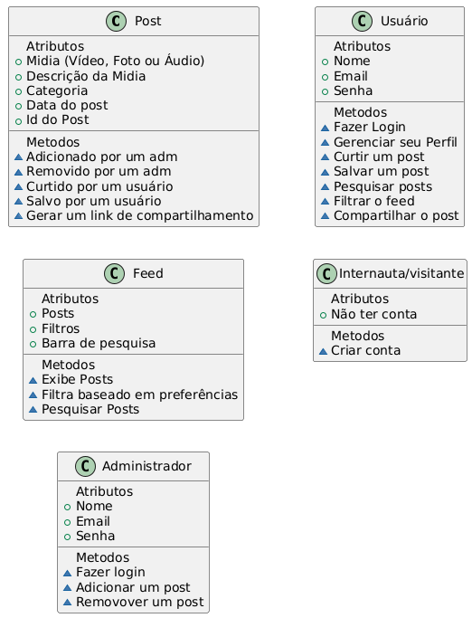
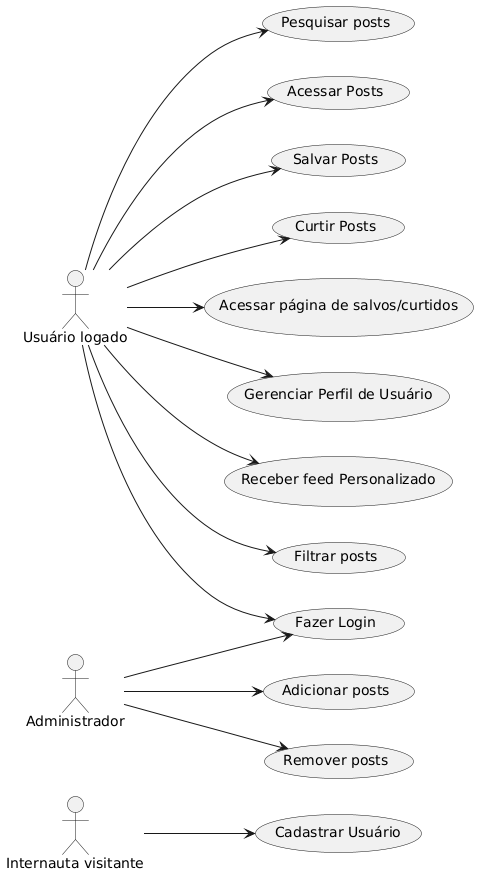

<figure markdown="span">
  {width="378"}
    <figcaption>Diagrama de Classes</figcaption>
</figure>
<figure markdown="span">
  {width="378"}
    <figcaption>Diagrama de Casos de Uso</figcaption>
</figure>