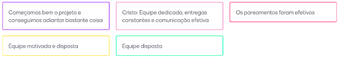

# Interação 1 (05/02/24 à 12/04/2024)

## Planejamento de Interação
#### Presentes na reunião: XXXXX

###  Lista de Tarefas da Interação

|Tarefa|Responsabilidade|
|---|----|
| Decidir o nome o projeto.|Todos|
| Criar o repositório nos padrões (Organizar wiki).| Fellipe|
| Criar issues no GitHub / ZenHub| Joao Pedro|
| Configuração do grupo do Telegram(configurar bot).|Fellipe|
| Estudar e escolher as metodologias.| Todos|
| [Documento de visão](https://github.com/xxx/xxx.md) |Fellipe|
| Elaborar [5w2H](https://github.com/Projetos-de-Extensao/PBE_24.2_8001_IV_HighlightHub/blob/main/docs/base/5w2h.md) |Fellipe e João Pedro|
| [Mapas Mentais](https://github.com/Projetos-de-Extensao/PBE_24.2_8001_IV_HighlightHub/blob/main/docs/base/mapa_mental.md) |Hugo|
| [Brainstorming](https://github.com/Projetos-de-Extensao/PBE_24.2_8001_IV_HighlightHub/blob/main/docs/base/Brainstorm.md) |Todos|
|[Entrevistas](https://github.com/Projetos-de-Extensao/PBE_24.2_8001_IV_HighlightHub/blob/main/docs/base/entrevista.md) |Fellipe|
|[Prototipação.](https://github.com/xxx/xxx.md) |Joao Pedro|

## Sprint Retrospective/Review Meeting

#### Presentes na reunião: XXXX

### Dividas da Interação
- 
- 
- 
- 

### Riscos Encontrados

- Nenhum: Plano de gerenciamento de riscos não implementado.

### Pontos Positivos

-
-
- 
-

### Pontos Negativos

-
-
- 
-

### O que podemos melhorar?
- Ter mais foco na reuniões para evitar o desperdício de tempo.
- A equipe deve ter mais autonomia em relação à falta de membros.
- Podemos utilizar algo ferramenta de timebox para maior efetividade nas reuniões, sugestão: https://timebox.cedrotech.com/

### Ferramentas utilizadas

- Reunião: [Hangouts](https://hangouts.google.com/)
- Colheita dos pontos: [Mentimeter](https://www.mentimeter.com/)

